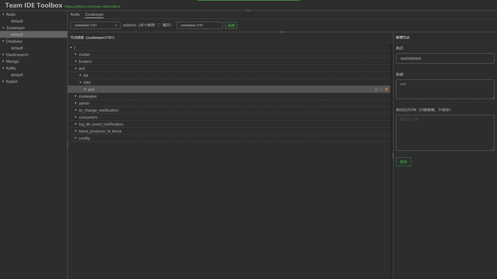
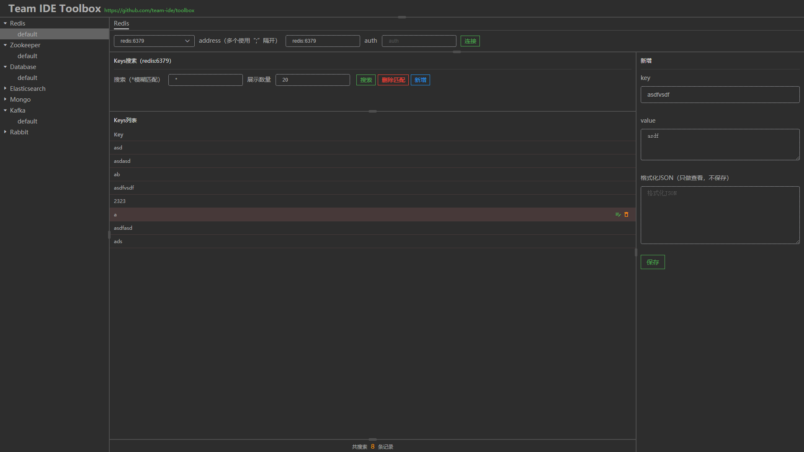
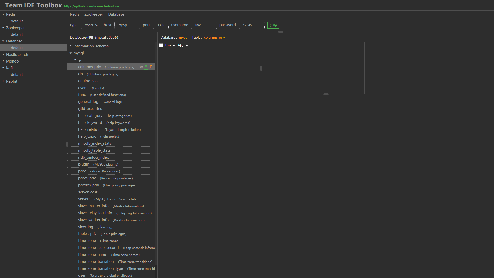

# Toolbox

在线连接MySql、Redis、Zookeeper、Kafka、RabbitMQ、MongoDB、Elasticsearch等

## 目录结构说明

```js
./html       //前端源码
./java       //java服务端代码
./go         //go服务端代码
./release    //服务端发布将在此目录生成可执行文件
```

## 功能描述

1. Zookeeper

    * 工具可以连接Zookeeper（单机或集群）
    * 新增、修改、删除节点等
    * 树状展示节点

2. Redis

    * 工具可以连接Redis（单机或集群）
    * 新增、修改、删除缓存等
    * 目前只支持string类型key和value

3. Database

    * 工具可以连接 数据库（目前支持Mysql）
    * 展示库表信息
    * 持续更新
    * 目标在线建库、建表、查看库表SQL、修改表、修改SQL、表数据查看、表数据在线编辑、自定义SQL、数据导入导出等

4. Kafka

    * 工具可以连接Kafka（单机或集群）
    * 展示Topic列表、删除Topic、设置Topic分区
    * 拉取Topic消息、提交消息、删除消息、消息推送等

5. RabbitMQ
    * 研发中
6. Elasticsearch
    * 研发中
7. MongoDB
    * 研发中

## 打包发布

### 前端

* 前端工程使用vue开发，打开html目录，编译项目文件
* 前端不会单独发布，每次更改后进行构建，然后放置服务端，将前端页面打包至服务端

### 服务端

#### java 服务端

* 拷贝前端打包dist目录下所有问题至web\src\main\webapp目录（删除原有文件）
* java服务端，包管理使用maven，在根目录install即可，将会生成release目录，该目录下可以执行放至服务器运行

#### go 服务端

* 拷贝前端打包dist目录下所有问题至web\webapp目录（删除原有文件）
* 使用go-bindata将html源文件打包成go资源文件
* go服务端
